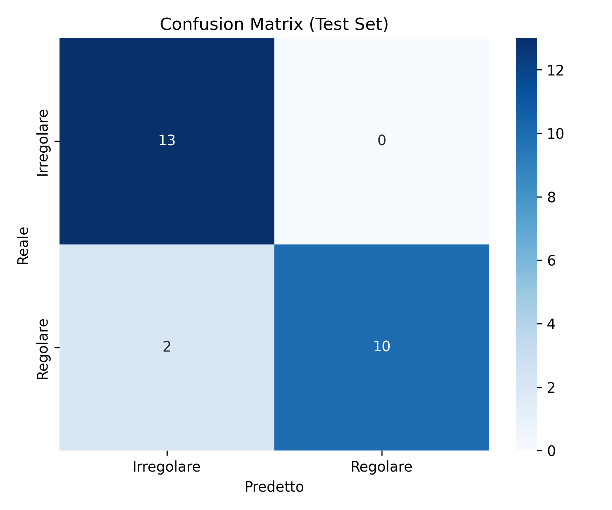

# Neural Table Tennis

Prototipo di ricerca e sviluppo per la classificazione automatica di servizi nel tennis tavolo a partire da video.

L'obiettivo del progetto e' distinguere tra servizi regolari e irregolari usando una pipeline di computer vision e deep learning. Il lavoro nasce come sperimentazione pratica su video reali, con estrazione di feature tramite MediaPipe/OpenCV e addestramento di modelli neurali con TensorFlow/Keras.

## Perche questo progetto

Nel tennis tavolo la valutazione di un servizio puo' dipendere da dettagli molto rapidi: postura, movimento del braccio, traiettoria iniziale e timing dell'azione. Questo progetto esplora la possibilita' di usare modelli di machine learning e deep learning per supportare l'analisi tecnica del gesto.

Il repository rappresenta una base sperimentale, non ancora un prodotto finito. La direzione futura e' trasformarlo in una web/mobile app in cui l'utente possa caricare un video, ricevere una classificazione del servizio e visualizzare un feedback sul movimento rilevato.

## Cosa fa attualmente

- raccoglie video divisi in due classi: servizi regolari e servizi irregolari
- estrae feature dai frame video usando OpenCV e MediaPipe
- standardizza le sequenze video su una lunghezza fissa
- addestra modelli Keras/TensorFlow per classificazione binaria
- confronta architetture diverse, tra cui modelli LSTM e CNN 1D
- salva modelli addestrati e metriche di valutazione
- produce una matrice di confusione per analizzare gli errori del modello

## Stack tecnico

- Python
- OpenCV
- MediaPipe
- NumPy
- scikit-learn
- TensorFlow / Keras
- Matplotlib / Seaborn
- Jupyter Notebook

## Struttura del repository

```text
.
+-- dataset/
|   +-- regolari/
|   +-- irregolari/
+-- test/
+-- Untitled.ipynb
+-- Untitled_overfitting.ipynb
+-- requirements.txt
+-- X_features.npy
+-- y_labels.npy
+-- *.keras
+-- confusion_matrix_finale.png
```

## Risultati preliminari

Il progetto include modelli addestrati e una matrice di confusione generata durante la fase di valutazione.



I risultati sono da considerare preliminari: il dataset e' ancora limitato e il modello deve essere validato su video piu' vari, con condizioni diverse di luce, angolazione, distanza dalla camera e stile di gioco.

## Come eseguirlo

1. Crea un ambiente virtuale Python.

```bash
python -m venv .venv
```

2. Attiva l'ambiente virtuale.

```bash
# Windows
.venv\Scripts\activate

# macOS/Linux
source .venv/bin/activate
```

3. Installa le dipendenze.

```bash
pip install -r requirements.txt
```

4. Avvia Jupyter Notebook.

```bash
jupyter notebook
```

5. Apri `Untitled.ipynb` per consultare la pipeline principale di estrazione feature, training e valutazione.

## Stato del progetto

Il progetto e' attualmente in fase prototipale. La priorita' non e' ancora avere un'applicazione pronta per l'utente finale, ma validare la fattibilita' tecnica della classificazione video.

Le aree principali da migliorare sono:

- pulizia dei notebook e separazione della pipeline in script riutilizzabili
- ampliamento e bilanciamento del dataset
- validazione piu' robusta con video non visti
- gestione dei file pesanti tramite storage esterno o Git LFS
- creazione di un'API per inferenza su video caricati
- sviluppo di una web/mobile app per testare il modello in modo piu' accessibile

## Roadmap

- Convertire i notebook in moduli Python organizzati:
  - preprocessing video
  - estrazione landmark
  - training
  - evaluation
  - inference
- Creare un endpoint API per caricare un video e ricevere la predizione.
- Aggiungere una UI web/mobile per testare il modello.
- Salvare output interpretabili, ad esempio frame annotati o grafici dei landmark.
- Studiare una pipeline live per riconoscere l'inizio del servizio durante una partita.
- Segmentare automaticamente il servizio in tempo reale.
- Eseguire inferenza sulla finestra video segmentata e classificare il gesto.

## Possibile evoluzione live

La parte piu' complessa del progetto e' l'inferenza live durante un match. In quel caso non basta classificare un video gia' tagliato: il sistema dovrebbe rilevare automaticamente quando inizia un servizio, isolare la finestra temporale corretta e inviarla al modello.

Una possibile architettura futura potrebbe essere:

1. acquisizione video live da camera
2. rilevamento continuo della pose con MediaPipe
3. analisi temporale dei landmark per individuare l'inizio del gesto
4. segmentazione automatica dei frame del servizio
5. classificazione del segmento con modello neurale
6. visualizzazione del risultato in tempo quasi reale

## Nota personale

Questo progetto fa parte del mio interesse per la ricerca applicata all'intelligenza artificiale, in particolare nell'unione tra computer vision, machine learning e deep learning. L'obiettivo e' farlo evolvere da notebook sperimentale a sistema utilizzabile, mantenendo una forte attenzione alla parte di modellazione, validazione e inferenza.
